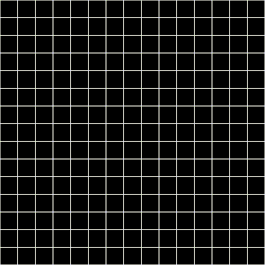

# Path Finding using Python
### How to use
  - First click is used to set a start point on the grid (Green)
  - Second click is used to set a finish point on the grid (Red)
  - Future clicks are used to create walls on the grid (Grey)
  - Walls are not required to run, when ready press space to begin path finding
  - Solution will be shown in cyan
  - Debug mode can be toggled from the script to display progress as it solves (Decreases solving time)
  - Yellow: Tiles the algorithm knows exist but has not yet explored
  - Pink: Tiles the algorithm knows exist and has explored
  - Pressing the "r" key will reset the board, instead of having to close and oepn again, can happen at any time
  - Pressing the "g" key will generate a random start and finish position and then attempt to solve it a second later

### Installation
Requires Python3 to run.
Install the dependencies to use.
```sh
$ pip install pygame
```

### Evidence
Using Debug


Without debug


